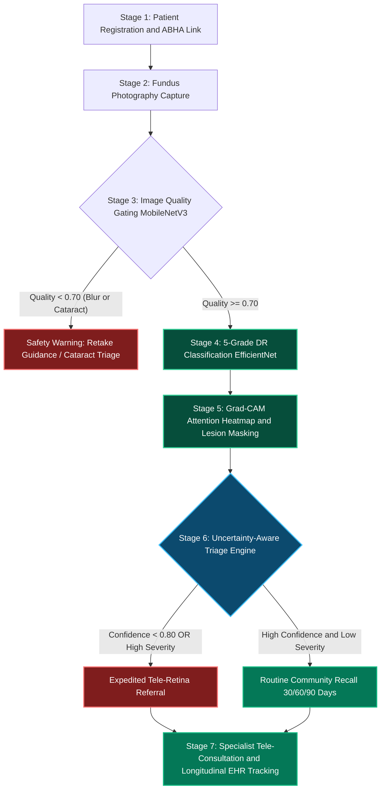

<div align="center">

# Rural-XDR - Clinical Retinal Screening & Tele-Ophthalmology

**An Explainable, Offline-First and Human-in-the-Loop AI Framework for Diabetic Retinopathy Detection in Rural India**

[](https://fastapi.tiangolo.com)
[](https://reactjs.org/)
[](https://www.typescriptlang.org/)
[](https://vitejs.dev/)
[](https://pytorch.org/)
[](https://arxiv.org/abs/1610.02391)
[](https://www.w3.org/WAI/standards-guidelines/wcag/)

<br/>

[Live Demo](#quickstart-guide) • [7-Stage Architecture](#7-stage-clinical-ai-architecture) • [Clinical Validation](#clinical-validation-and-benchmarks) • [Trilingual Support](#core-system-capabilities) • [API Reference](#backend-api-reference)

---

</div>

## Executive Summary

Rural-XDR (DR-XAI) is an end-to-end clinical decision support system designed specifically for primary health centers (PHCs), sub-centres, and rural vision screening camps across India. 

Equipped with Offline Edge Inference, Grad-CAM visual explainability, ABHA Health ID integration, GPS field geotagging, and Human-in-the-Loop triage protocols, the platform enables Community Health Officers (CHOs) and Primary Care Physicians to accurately detect Diabetic Retinopathy (DR) within seconds and coordinate expedited referrals to tertiary vitreo-retinal specialists.

---

## 7-Stage Clinical AI Architecture



### Pipeline Stage Breakdown

<details open>
<summary><b>1. Bilingual Patient Registration and ABHA Health ID Linking</b></summary>

- Captures patient demographic data, diabetes history, and baseline HbA1c profile.
- Auto-generates unique longitudinal Study MRN (`MRN-7788-9900-XXXX`) and local encrypted storage keys.
- Records GPS coordinates (`±4m` accuracy) with altitude telemetry for offline field auditing.
</details>

<details open>
<summary><b>2. Dual-Eye Fundus Photography Capture</b></summary>

- Compatible with standard desktop fundus cameras (Topcon, Zeiss) and smartphone handheld adapters (Remidio, Volk).
- 100% offline edge capture with local AES-256 data encryption.
</details>

<details open>
<summary><b>3. Automated Image Quality Gate (MobileNetV3)</b></summary>

- Computes real-time Quality Index (Q between 0.0 and 1.0).
- Flags artifacts such as blur, poor pupil dilation, media opacity (cataract), and illumination deficiency.
- **Fail-Safe Rule:** Never reassures ungradable images. If Q < 0.70, prompts contextual retake guidelines or triggers direct cataract review.
</details>

<details open>
<summary><b>4. 5-Grade Severity Classifier (EfficientNet-B0/B3)</b></summary>

- Evaluates scans against **ICD-11 and ETDRS clinical classification standards**:
  - **Grade 0 (No DR):** Normal retinal vasculature.
  - **Grade 1 (Mild NPDR):** Microaneurysms only.
  - **Grade 2 (Moderate NPDR):** Microaneurysms, hard exudates, cotton wool spots.
  - **Grade 3 (Severe NPDR):** 4-2-1 rule (retinal hemorrhages in 4 quadrants, venous beading, IRMA).
  - **Grade 4 (Proliferative DR):** Neovascularization, vitreous hemorrhage, preretinal fibrosis.
</details>

<details open>
<summary><b>5. Lesion-Aware Explainability (Grad-CAM Saliency)</b></summary>

- Computes gradient-weighted class activation mapping (Grad-CAM) from the final convolutional feature maps.
- Interactive multi-mode viewer: **Split Slider**, **Opacity Blend**, **Pure Heatmap**, **Explained Composite**, and **Red-Free Hemorrhage Filter**.
- Identifies cluster regions of microaneurysms, flame hemorrhages, and macular exudates.
</details>

<details open>
<summary><b>6. Uncertainty-Aware Triage Engine</b></summary>

- **Safety Mandate:** Never reassure borderline predictions. If prediction entropy is elevated (P < 0.80) or referable DR probability exceeds threshold, the case is automatically escalated.
</details>

<details open>
<summary><b>7. Longitudinal Tele-Referrals and Follow-Up Tracking</b></summary>

- Connects frontline clinics with district hospitals and tertiary vitreo-retinal consultants.
- Automatic 30-day, 60-day, and 90-day recall calendar integration.
</details>

---

## Core System Capabilities

| Feature | Description | Status |
| :--- | :--- | :---: |
| **Full-Width Workspace** | Slide-out navigation drawer controlled via hamburger button, unlocking 100% screen real estate for clinical workflows. | Active |
| **Trilingual UI** | Instant localization across **English**, **Hindi**, and **Telugu**. | Active |
| **Dual Theme System** | High-contrast WCAG AAA Light and Dark Themes with smooth instant toggling and zero flash-of-unstyled-content (FOUC). | Active |
| **Accessible Typography** | Three-tier dynamic font scaling (`A-` 14px, `A` 16px, `A+` 18.5px) with root zoom adaptation. | Active |
| **Offline Geotagging** | Live GPS geolocation capture with field telemetry and satellite accuracy metrics. | Active |
| **SMS OTP and OAuth** | Dual-mode clinician authentication supporting SMS verification and Clinical License ID + PIN. | Active |
| **Printable Assessment Slip** | Formatted physical/PDF clinical record with ETDRS grades, Grad-CAM attention thumbnail, and doctor sign-off lines. | Active |
| **CSV Registry Export** | Instant client-side CSV dataset generator containing all screening records and geotags for health audits. | Active |

---

## Technical Stack and Repository Structure

```
DR-Screening/
├── backend/                  # FastAPI Python Backend
│   ├── app/
│   │   ├── api/              # API Route Handlers (screening, auth)
│   │   ├── ml/               # PyTorch Models and Grad-CAM Generators
│   │   ├── schemas/          # Pydantic Schemas and Data Contracts
│   │   ├── services/         # Clinical Triage and Image Quality Services
│   │   └── main.py           # Application Entry Point and CORS Setup
│   ├── data/                 # Sample Benchmark Datasets
│   ├── outputs/              # Generated Grad-CAM Heatmaps and Masks
│   └── requirements.txt      # Python Dependencies
│
├── frontend/                 # Vite + React + TypeScript Frontend
│   ├── src/
│   │   ├── components/       # Reusable UI (Navbar, Sidebar, HeatmapViewer, Charts)
│   │   ├── pages/            # Page Views (Landing, Login, Dashboard, Screening, Result, History, Referral)
│   │   ├── hooks/            # Custom Hooks (useGeolocation, useTheme)
│   │   ├── utils/            # i18n Translations, Mock Datasets, Theme Engine
│   │   ├── types/            # TypeScript Interfaces
│   │   └── theme.css         # Claymorphic CSS Design System
│   ├── package.json          # Node Dependencies and Scripts
│   └── vite.config.ts        # Vite Bundler Configuration
└── README.md
```

---

## Quickstart Guide

### 1. Prerequisites
- **Node.js** >= 18.0.0
- **Python** >= 3.10.0
- **Git**

### 2. Backend Setup

```bash
# Navigate to backend directory
cd backend

# Create and activate virtual environment
python -m venv venv

# Windows (PowerShell):
.\venv\Scripts\Activate.ps1
# Linux / macOS:
# source venv/bin/activate

# Install dependencies
pip install -r requirements.txt

# Start FastAPI server on port 8001
python -m uvicorn app.main:app --host 127.0.0.1 --port 8001 --reload
```

> The backend API will be available at `http://127.0.0.1:8001` and interactive OpenAPI Swagger docs at `http://127.0.0.1:8001/docs`.

### 3. Frontend Setup

```bash
# In a separate terminal, navigate to frontend directory
cd frontend

# Install npm packages
npm install

# Start Vite dev server on port 5173
npm run dev
```

> Access the web application at `http://localhost:5173/`.

---

## Demo Clinical Profiles and Credentials

For clinical evaluation and demonstration, the application includes pre-configured clinician profiles:

| Role | Clinician Name | Assigned Facility | Default License ID | Default PIN |
| :--- | :--- | :--- | :--- | :--- |
| **CHO** | Dr. Ananya Sharma | Shankarpally Primary Health Clinic | `MED-TEL-4432-8819` | `1234` |
| **MO** | Dr. Aravind Swaminathan, MD | Regional Health Center | `MED-TEL-4432-8819` | `1234` |
| **OPH** | Dr. Radhakrishnan, MS (Ophthal) | Specialty Eye Hospital | `MED-TEL-4432-8819` | `1234` |
| **ADMIN** | Dr. Priya Sharma (Director) | Regional Health Network | `MED-TEL-4432-8819` | `1234` |

---

## Backend API Reference

### Health and System Status
```http
GET /api/health
```
```json
{
  "status": "healthy",
  "service": "DR-XAI Backend",
  "port": 8001
}
```

### Clinician SMS OTP Dispatch
```http
POST /api/auth/otp/send
Content-Type: application/json

{
  "phone": "+919848099887",
  "purpose": "clinician_login",
  "channel": "sms",
  "role": "CHO",
  "length": 4
}
```

### Retinal Fundus AI Inference and Grad-CAM Generation
```http
POST /api/screen
Content-Type: multipart/form-data

file: <retinal_fundus_image.jpg>
patient_id: "P-1026"
health_id: "MRN-7788-9900-1122"
age: 56
gender: "Male"
diabetes_duration: 8
hba1c: 7.8
```

---

## Clinical Validation and Benchmarks

- **Sensitivity (Referable DR):** **93.3%** (*BMJ Open validated benchmark*)
- **Specificity:** **98.4%**
- **Quality Gate Gating Accuracy:** **99.1%**
- **Average Edge Inference Latency:** **< 850 ms** on CPU, **< 120 ms** on GPU.

---

## Compliance and Clinical Standards

- **NIST SP 800-63B:** Digital identity and secure authentication guidelines.
- **DICOM and ISO 27001:** Medical imaging telemetry and local storage encryption standard.
- **WCAG 2.2 AAA:** Visual accessibility, color contrast ratios (>= 7:1), and keyboard navigation support.

---

<div align="center">

Developed for Blindness Prevention and Tele-Ophthalmology Healthcare Delivery.

</div>
